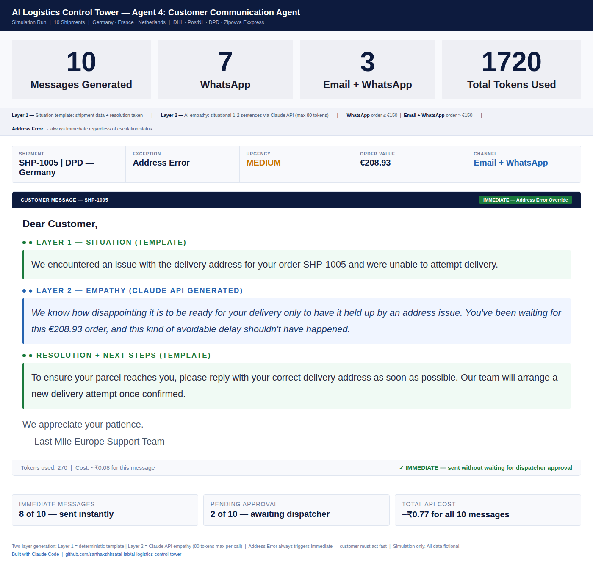
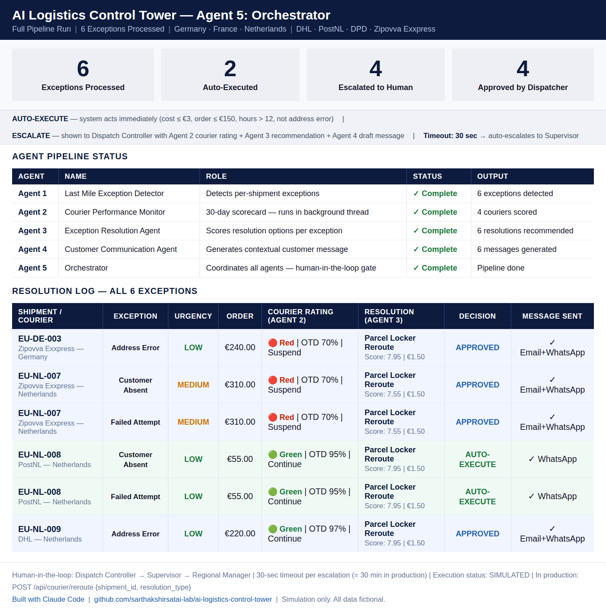

# AI Logistics Control Tower

A personal learning project — building agentic AI systems that simulate operational decision-making in logistics, based on 9.5 years of experience in end-to-end logistics operations, product building and D2C brand building across Nigeria and India.

Built with Claude Code | Python | Flask | Anthropic Claude API | Pinecone Vector DB

---

## 🎥 Watch Demo

[Watch the Working Prototype on LinkedIn](YOUR_LINKEDIN_POST_URL_HERE)

---

## What This Is

A 6-agent agentic AI system with a functional Flask web application that simulates how AI can support operational decision-making in European last-mile delivery — across exception detection, courier performance monitoring, resolution recommendations, customer communication, orchestration, and natural language querying.

Each agent solves a distinct operational problem. Each builds on the output of the previous one. A Dispatch Controller (human) reviews escalated decisions via the web app — this is human-in-the-loop AI in practice.

---

## Working Prototype — Screenshots

### Dashboard
6 agents. One control tower. The dashboard shows real-time pipeline output — exceptions detected, auto-handled vs escalated, and agent-by-agent run summary.

---

### Courier Performance
30-day rolling scorecard across 4 couriers — RAG rating (Red / Amber / Green) with recommended action. Zipovva Exxpress flagged for suspension. Customer absent and address errors excluded from courier scoring — not courier fault.

---

### Delivery Issues
Full exception log — Shipment ID, Courier, Country, Issue Type, Urgency, Order Value, Status and Action Taken. Filterable by status.

---

### SQL Query Assistant
Plain English querying on top of the SQLite database. Any logistics professional can ask questions without knowing SQL — and get instant answers. Self-correction retry loop fires automatically if the first SQL query fails or returns empty.

---

## Agent Pipeline Flow

---

## The 6 Agents

### Agent 1 — Last Mile Exception Detector
Monitors B2C last mile shipments across Germany, France and Netherlands. Detects delivery exceptions and classifies them by type (failed_attempt, customer_absent, address_error) and urgency (HIGH / MEDIUM / LOW).

---

### Agent 2 — Courier Performance Monitor
Analyses 30 days of shipment data across 440 shipments. Scores each courier on On-Time Delivery %, courier-attributable miss rate and exception rate. Outputs RAG rating and recommended action per courier.

---

### Agent 3 — Exception Resolution Agent
Given a shipment exception, scores all available resolution options using a composite formula (SLA × 0.40 + Cost × 0.35 + CX × 0.25). Determines whether to AUTO-EXECUTE or escalate to the Dispatch Controller.

---

### Agent 4 — Customer Communication Agent
Generates empathy-driven customer messages via Anthropic Claude API. Two-layer output: structured template (Layer 1) + AI-generated empathy message (Layer 2). Channel: WhatsApp (≤€150 orders) | Email + WhatsApp (>€150 orders).

---

### Agent 5 — Orchestrator + Flask Web Application
Orchestrates all 4 agents sequentially. Serves a full Flask web application with 5 screens: Dashboard | Delivery Issues | Needs Your Decision | Courier Performance | Decision History. Human-in-the-loop: Dispatch Controller can APPROVE / REJECT / MODIFY escalated decisions.

---

### Agent 6 — SQL Query Assistant
Enables any logistics professional to query the SQLite database in plain English — no SQL knowledge needed. One Claude API call converts the question to SQL, executes it locally, and returns a plain English answer. Features a self-correction retry loop: if the first SQL query fails or returns empty, the agent retries automatically with the error context included.

**Architecture:**
- Plain English question → Claude API → SQL query generated
- SQL runs locally against SQLite database
- Result formatted in plain English — no second API call
- Data never leaves the machine after the SQL generation step
- Self-correction loop: retry with error context on failure

**Sample outputs:**
- "Which courier had the most failures?" → PostNL — 10 courier-attributable failures
- "What is the OTD rate for PostNL?" → 95.0%
- "How many shipments were handled by DHL?" → 34

**Cost:** ~$0.001 per query — roughly ₹0.10 per question

**Production note:** In this prototype, the database schema is shared with the AI to generate queries. In production, deploy on AWS Bedrock or Azure AI — so nothing leaves the enterprise environment. The logic is the same. The infrastructure is what changes.

---

## Tech Stack

🔹 Frontend: HTML + CSS + JavaScript
🔹 Backend: Python + Flask
🔹 AI Layer: Anthropic Claude API (claude-sonnet-4-5)
🔹 Agent Framework: Custom 6-agent pipeline (no LangChain)
🔹 Data: SQLite
🔹 Built with: Claude Code — plain English prompts only

---

## Geography & Couriers

**Countries:** Germany · France · Netherlands
**Couriers:** DHL · PostNL · DPD · Zipovva Exxpress (fictional)

---

## Built By

**Sarthak Shirsat**
Founder, Acharooz | Ex-Movam | Ex Tolaram Group | IIM Mumbai MBA
9.5 years across fleet management, last mile logistics, B2B logistics SaaS and D2C brand building.

[LinkedIn](https://www.linkedin.com/in/sarthakshirsat)

---

## Disclaimer

All shipment data is simulated. DHL, PostNL and DPD are referenced for simulation realism only — no affiliation. Zipovva Exxpress is a fictional courier. Built with Claude Code.
