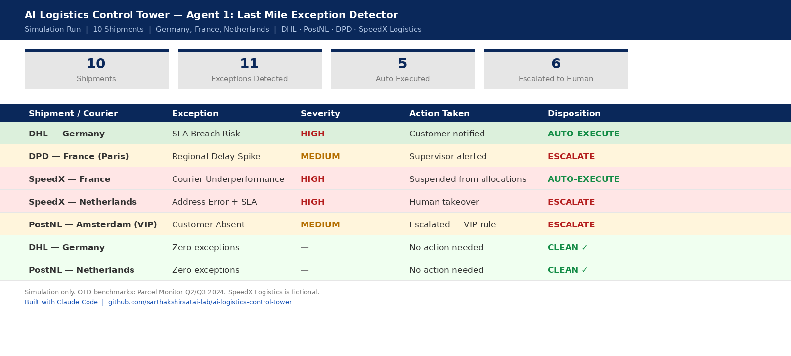
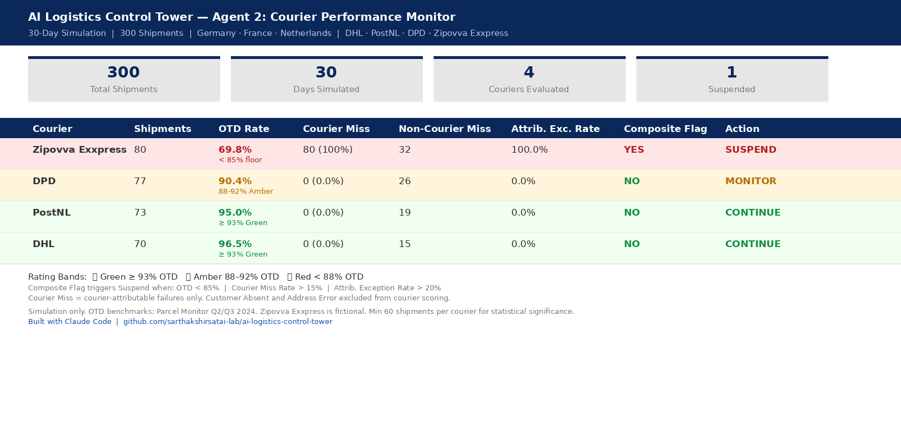
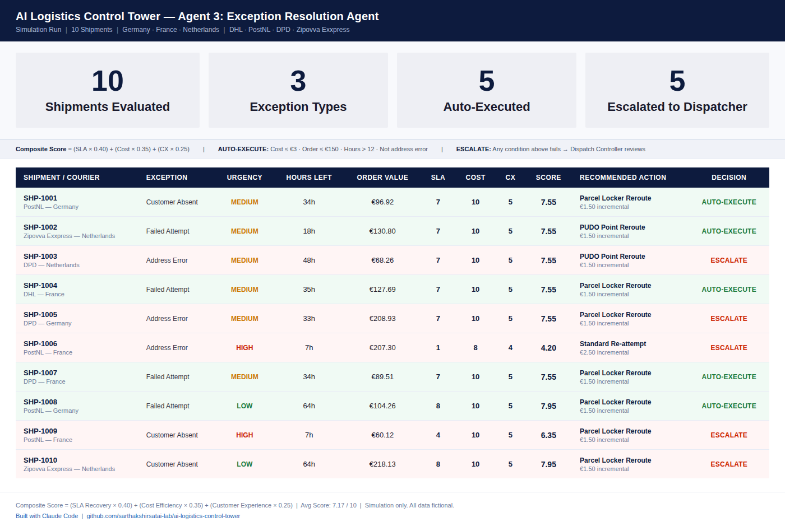

# AI Logistics Control Tower

A personal learning project — building agentic AI 
systems that simulate operational decision-making 
in logistics, based on 8.5 years of experience in 
end-to-end logistics operations across Nigeria and India.

Built with Claude Code | Python

---

## What This Is

A 5-agent system that simulates how AI can support 
operational decision-making in European last-mile 
delivery — across exception detection, courier 
performance monitoring, resolution recommendations, 
customer communication and orchestration.

Each agent solves a distinct operational problem. 
Each builds on the output of the previous one.

---

## Agents

### Agent 1 — Last Mile Exception Detector
Monitors B2C last mile shipments across Germany, 
France and Netherlands. Detects delivery exceptions 
in real-time and classifies them by type and severity.

---

### Agent 2 — Courier Performance Monitor
Analyses 30 days of shipment data across 300 shipments. 
Scores each courier on performance and outputs a 
recommended action per courier.

---

### Agent 3 — Exception Resolution Agent
Given a shipment exception, evaluates all available 
remediation options and recommends the optimal action. 
Determines whether to AUTO-EXECUTE or escalate to a 
human Dispatch Controller.

---

### Agent 4 — Customer Communication Agent
*(Coming soon — Thu 8 May)*

---

### Agent 5 — Orchestrator
*(Coming soon — Mon 12 May)*

---

## Geography & Couriers

**Countries:** Germany · France · Netherlands

**Couriers:** DHL · PostNL · DPD · 
SpeedX Logistics (Agent 1, fictional) · 
Zipovva Exxpress (Agents 2-3, fictional)

---

## Built By

Sarthak Shirsat
Founder, Acharooz | Ex-CPO, Movam Technologies | 
IIM Mumbai MBA

8.5 years across fleet management, last mile 
logistics, B2B logistics SaaS and D2C brand building.

---

## Disclaimer

All shipment data is simulated. 
Courier OTD benchmarks based on 
Parcel Monitor Q2/Q3 2024.
SpeedX Logistics and Zipovva Exxpress 
are fictional couriers.
Built with Claude Code.
